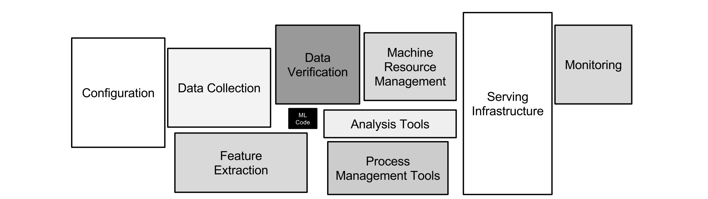

Research Summary
---

Machine Learning systems comprised of multiple parts, which the model is the smallest one compared to the others.

Some examples of other involved parts are:

1. Serving
2. Data Collection
3. Monitoring
4. Machine Resource Management

illustration is from experience of engineers at Google, [1](#tech-debt)

Engineers at Google state that, developing ML Systems is cheap and fast, but maintaining them overtime is challenging and very expensive. [1](./RESOURCES)

## Common Challanges

### Entanglement

Machine learning models mix input signals in complex ways, making it hard to improve one part without affecting everything else. Changing one input, adding or removing features, or tweaking settings (like Hyperparameters or data) can change the whole system. This is called the CACE principle: **Changing Anything Changes Everything**.

To manage this, two strategies are suggested:
1. **Use isolated models in ensembles**—this works when tasks are separate, but sometimes improving one model can hurt the overall performance.
2. **Monitor prediction changes**—using tools like visualizations and slice-based metrics can help detect and understand changes in model behavior.
 
### Correction Cascades

**Correction Cascades** happen when a model for problem A is adjusted to solve a similar problem A′ by adding a small correction model. This correction depends on the original model, making future improvements harder and more expensive. If more corrections are added on top (for problems like A′′), it creates a chain of dependencies that can trap the system, where improving one part might harm the whole system.

To avoid this, two solutions are suggested:
1. **Improve the original model** by adding features to handle new cases directly.
2. **Build a separate model** for the new problem, even if it costs more.

### Data Dependencies

**Data Dependencies Cost More than Code Dependencies** because they are harder to detect and manage. Unlike code dependencies, which tools can track, data dependencies can silently grow and become complex.

**Unstable Data Dependencies** happen when models rely on changing input data (e.g., updated ML models or lookup tables). Even small improvements in input data can harm model performance.

A common fix is **versioning data**, keeping stable copies of input data to avoid sudden changes, though this also adds extra costs.

### Pipelines Jungles

**Pipeline Jungles** are messy and complex data preparation systems that grow as new data sources and processing steps are added. They involve many scrapes, joins, and files, making error detection, testing, and maintenance difficult and expensive.

To avoid this, teams should **plan data processing carefully** or **redesign pipelines completely** for better efficiency.

These issues often happen when research and engineering teams work separately. A **hybrid team** combining both roles can reduce these problems and improve collaboration.

---
References
---

#### Hidden Technical Debt in Machine Learning Systems
[Read the paper here](https://proceedings.neurips.cc/paper_files/paper/2015/file/86df7dcfd896fcaf2674f757a2463eba-Paper.pdf)
